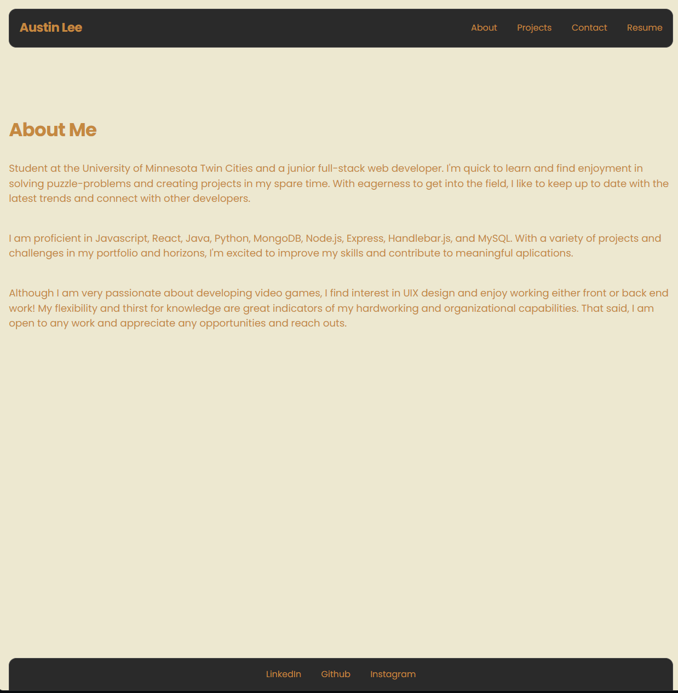

# portfolio-2.0
## Description
This project/site is just a revised version of my portfolio utilizing React and netlify. This was a nice simple challenge for me to see how far I've come since my original portfolio and it's safe to say that I've learned quite a bit in the last few months!

## Usage
You can access the site here: [Portfolio]()

## Screenshot/Demo

## License
MIT License

## Questions
If you have any questions, please feel free to contact me at [mnaustinlee@gmail.com](mailto:mnaustinlee@gmail.com). 

You can also find more of my work at [Kushonim](https://github.com/Kushonim).
